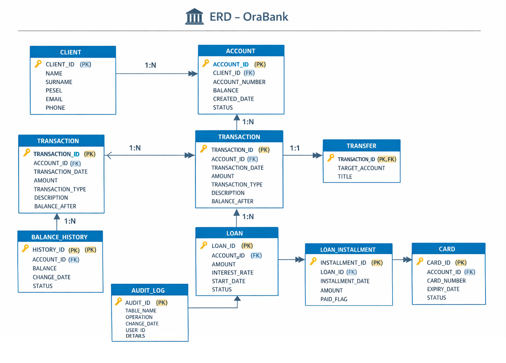

# 🏦 Baza danych OraBank 

Projekt przedstawiający system bankowy,
zaprojektowany tak, jak w rzeczywistych systemach bazodanowych.

Celem projektu jest odwzorowanie architektury i procesów stosowanych w dużych bankach.

## 🎯 Cel projektu

Projekt umożliwia:

- praktyczne wykorzystanie SQL i PL/SQL w realistycznym systemie bankowym  
- poznanie zaawansowanych mechanizmów baz danych Oracle  
- ćwiczenie projektowania modeli danych i relacji  
- sprawdzenie wydajności, bezpieczeństwa i audytu danych  

## 🧠 Zakres systemu

System bankowy obejmuje m.in.:

- klientów banku  
- rachunki bankowe  
- waluty  
- karty płatnicze  
- transakcje i przelewy  
- historię salda  
- kredyty i raty  
- audyt operacji  
- zadania cykliczne (joby)  

## 🧱 Architektura bazy danych

Projekt podzielony jest na logiczne obszary:

### Schematy:

- **BANK_CORE** – dane podstawowe (klienci, konta, karty)  
- **BANK_TX** – dane transakcyjne (duże wolumeny)  
- **BANK_ADMIN** – administracja i audyt  
- **BANK_REP** – raportowanie  

## 📁 Struktura projektu

## 🧰 Technologie

- Oracle Database 19c / 21c  
- SQL  
- PL/SQL  
- Oracle Partitioning  
- Oracle Scheduler  
- RMAN  

## 🔐 Zakres zastosowania

Projekt pokazuje praktyczne rozwiązania w zakresie:

- projektowania modeli danych i relacji  
- tworzenia tabel i indeksów  
- partycjonowania dużych zbiorów danych  
- programowania w PL/SQL  
- bezpieczeństwa i ról  
- audytu operacji  
- optymalizacji zapytań  
- strategii backupu i przywracania  

## 🚀 Status projektu

Projekt w trakcie realizacji.  
Etapy:

- [x] struktura katalogów  
- [x] dokumentacja  
- [x] model ERD  
- [x] tabele  
- [x] indeksy  
- [x] partycjonowanie  
- [x] PL/SQL  
- [x] bezpieczeństwo  
- [x] wydajność  
- [x] backup i recovery
