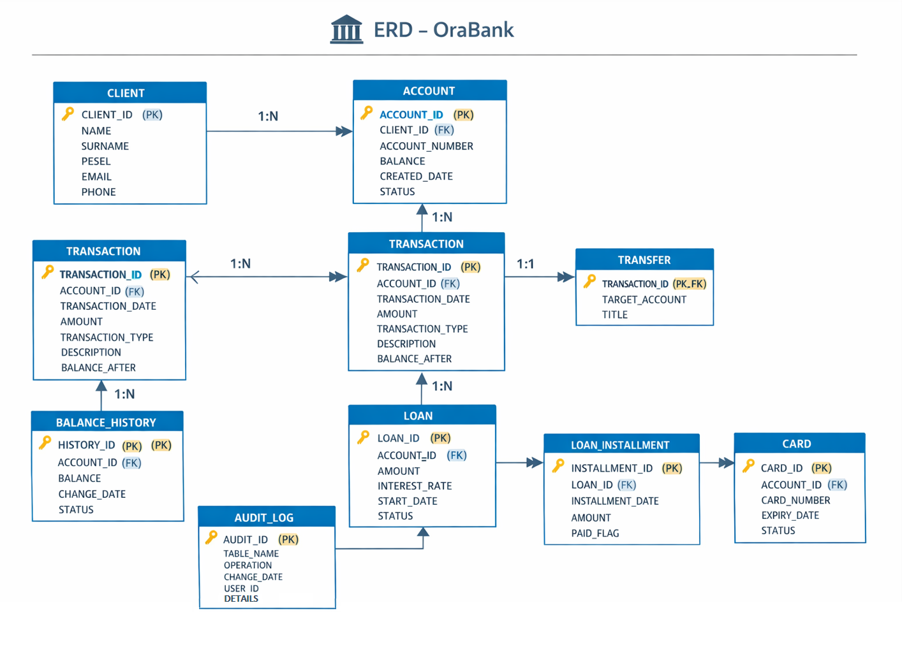

# OraBank - Oracle database system

An Oracle SQL and PL/SQL reference project for accounts, transfers, loans, auditing, access roles, Scheduler jobs, reporting, and recovery planning.

[Polska instrukcja](instrukcja_uruchomienia.md)

[](https://github.com/milekv/oracle-bank-system/actions/workflows/ci.yml)




OraBank focuses on database behavior rather than a mock banking interface. The central transfer package validates inputs, locks both accounts in a deterministic order, updates balances, writes balance history, stores the transaction pair, and leaves the final commit decision to the caller.

## Included modules

- Relational model for clients, accounts, cards, transfers, loans, and audit data.
- Indexes for foreign keys and common account and transaction paths.
- `ORABANK_ACCOUNT_PKG` with balance and transfer operations.
- Loan creation and installment payment procedures.
- Account history and loan interest functions.
- Balance audit trigger.
- Oracle Scheduler jobs for balance snapshots and expired loans.
- Least-privilege admin, teller, and auditor roles.
- Reporting views and an optional materialized view.
- Optional interval partitioning examples.
- Data Pump recovery runbook.
- SQL*Plus object validation and a transactional smoke test.

## Transfer behavior

`MAKE_TRANSFER` performs these steps in one caller-controlled transaction:

1. Rejects non-positive amounts and transfers to the same account.
2. Locks both active accounts in account ID order.
3. Verifies the sender balance.
4. Updates both balances and writes balance history.
5. Creates outgoing and incoming `BANK_TRANSACTION` rows.
6. Links the outgoing row to `TRANSFER`.
7. Rolls back to its savepoint on failure.

The package intentionally does not issue `COMMIT`.

## Install

Oracle Database 19c or 21c and SQL*Plus are required. Create an empty development schema without storing its password in scripts, connect as that schema, then run:

```sql
@install.sql
@tests/smoke_test.sql
```

Optional modules:

```sql
@10_wydajnosc/orabank_performance.sql
@05_partycjonowanie/orabank_partitioning.sql
```

Role and user creation requires an administrative connection:

```sql
@08_bezpieczenstwo/orabank_security.sql
```

That script prompts for passwords with hidden input and expires them on first login.

## Verification

`install.sql` fails on SQL errors and runs `tests/validate_objects.sql`. The smoke test creates isolated sample records, executes a transfer, checks balances and transaction counts, and rolls all test data back.

The GitHub workflow also runs repository checks for missing installation files, accidental example passwords, stale table names, and known invalid PL/SQL patterns.

## Repository map

```text
03_tabele              core relational model
04_indeksy             supporting indexes
05_partycjonowanie     optional interval partitioning lab
06_plsql               packages, procedures, and functions
07_triggery             audit trigger
08_bezpieczenstwo      roles, reporting views, and users
09_joby                Oracle Scheduler jobs
10_wydajnosc           optional reporting and statistics
11_backup              Data Pump recovery runbook
tests                   object validation and smoke test
```

## Scope

This is an educational database engineering project, not production banking software. Real deployment would additionally require encryption and key management, stronger identity controls, regulatory audit retention, reconciliation, idempotency keys, fraud controls, monitoring, disaster recovery exercises, and formal security review.

## License

MIT. See [LICENSE](LICENSE).
